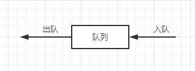
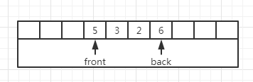
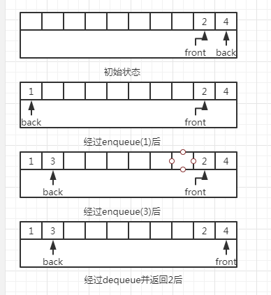

队列（queue）也是表，使用队列时插入在一端进行而删除在另一端进行。
## 队列模型
队列的基本操作是enqueue（入队）和dequeue（出队），它是在表的末端（队尾）插入一个元素，在表的开头（队头）删除一个元素。      
      
## 队列的数组实现
1. 跟栈的情形一样，对于队列而言任何表的实现都是合法的，对每一种操作，链表实现和数组实现都给出快速的O(1)运行时间，队列的
链表实现比较简单。
1. 对于每一个队列数据结构，保存一个数组theArray以及位置front和back，它们代表队列的两端。我们还要记录实际存在于队列中的
元素个数currentSize。
    
1. 数组的实现主要问题是在队列满了之后，因为back现在是数组的最后一个下表，而下一次再入队就会是一个不存在的位置。然而，队
列中也许只存在几个元素，因为若干元素可能已经出队了。跟栈一样即使在有许多操作的情况下队列也常常不是很大。简单的解决方法是
只要front或back到达数组的数组的尾端，他就又绕回到开头这叫作循环数组实现。
1. 实现回绕所需要的附加代码是极小的，不过它可能使得运行时间加倍。如果front或banck增加1导致超越了数组，那么其值就要重置
到数组的第一个位置。      
      
1. 在保证enqueue的次数不会大于队列容量的应用中，使用回绕是没有必要的。
## 队列的应用
 1. 当作业交给一台打印机时它们就以到达的顺序被排列其来，类似的业务就可以放在一个队列中。
 1. 当有多种PC机的网络设置，其中磁盘是放在一台叫做文件服务器的机器上，使用其他计算机的用户是按照先到先使用的原则访问文件
 的，因此其数据结构是一个队列。