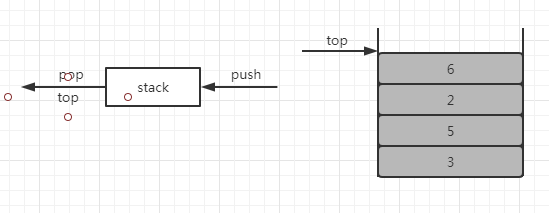

## 栈模型
1. [栈](../../java/org/lql/collections/Stack.java)（stack）：是限制插入和删除只能在一个位置上进行的表，该位置是表的末端，叫作栈的顶（top）。对栈的基本操作有push（进
栈）和pop（出栈）。最后插入的元素可以在执行pop之前通过使用top操作进行考查，对空栈进行pop或top一般被认为是栈ADT中的一个
错误。当push时空间用尽是一个实现限制不是ADT错误。
1. 栈有时也叫作LIFO（后进先出）表，下图中左侧模型只象征push是输入操作而pop和top是输出操作。清空栈操作和判断是否空栈都是
栈的操作指令系统的一部分，但是我们对栈能够做的基本上也就是push和pop操作。右侧图表示在进行若干操作后的一个抽象的栈，一般模
型是存在某个元素位于栈顶，而该元素是唯一的可见元素。      
      
## 栈的实现
1. 由于栈是一个表，因此任何实现表的方法都能实现栈，显然ArrayList和LinkedList都支持栈操作，均为简化操作。
1. 栈的链表实现：使用单向链表，通过在表的顶端插入来实现push，通过删除表的顶端元素来实现pop。top操作知识查询表顶端元素并
返回它的值。
1. 栈的数组实现：其避免了使用链接是更流行的栈解决方案。与每个栈相关联的操作是theArray和topOfStack，对于空栈它是-1，将
某个元素推入栈中使topOfStack增加1然后置theArray[topOfStack] = x。为了弹出栈元素，返回值为theArray[topOfStack]，然
后topOfStack减1。
## 应用
1. 平衡符号：编译器检查程序的语法错误常常由于缺少一个符号（如遗漏一个花括号或是注释的起始符）引起编译器列出上百行的诊断，
而真正的错误并没有找出。在这种情况下，一个有用的工具就是检验是否每件事情都能成对，于是每一个右花括号、右方括号及右圆括号
必然对应其相应的左括号。显然不值得为此编写一个大型程序，检验这些也是很容易的：做一个空栈读入字符直到文件结尾。如果字符是
一个开放符号，则将其推入栈中。如果字符是一个封闭符号，则栈空时报错。否则将栈元素弹出，如果弹出符号不是对应的开发符号就报
错。在文件结尾，如果栈非空则报错。
1. 后缀表达式：假设有一个便携式计算器并想要计算一趟外出购物的花费。为此我们将一列数据相加并将结果乘以1.06，它是所购物品
的价格以及附加的地方销售税，有些商品需要上税有些商品不需要。4.99 1.06*5.99+6.99 1.06*+这种方式称为后缀记法，其求值过
程就是将4.99和1.06相乘并存为A1，然后将5.99和A1相加，再将结果存入A1，以此类推。使用栈可轻松解决。