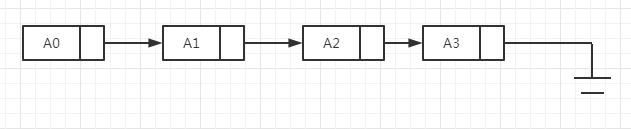
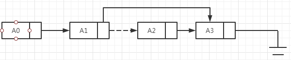
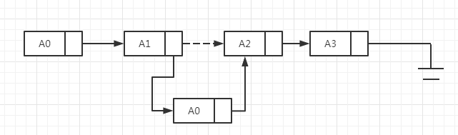
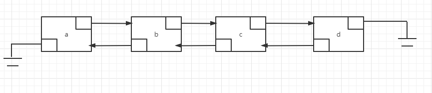

表、栈和队列是最简单和最基本的三种数据结构。实际上每一个有意义的程序都将显式地至少使用一种这样的数据结构，栈则在程序中总
是要被间接地用到，不管我们是否做了申明。
## 抽象数据类型
1. 抽象数据类型（abstract data type，ADT）：是带有一组操作的一些对象的集合。抽象数据类型是数学的抽象；在ADT的定义中没
有地方提到关于这组操作是如果实现的任何解释。诸如表、集合、图以及与他们各自的操作一起形成的这些对象都可以被看做抽象数据类
型，这就像整数、实数、布尔数都是数据类型一样。整数、实数和布尔数各自都有与之相关的操作，而抽象数据类型也是如此。如集合ADT
可以有add、remove以及contain这样的一些操作。
1. java类中也考虑到ADT的实现，不过适当地隐藏了实现的细节。这样程序需要对ADT实施操作的任何其他部分可以通过调用适当的方法
进行。如果由于某种原因需要改变实现的细节，那么通过仅仅改变执行这些ADT操作的例程应该是很容易实现，这种改变对于程序的其余部
分是完全透明的。
## 表ADT
1. 我们将处理形如A0，A1，A2，....，A(N-1)的一般的表，这个表的大小是N，大小为0的特殊表称为空表（empty list）。
1. 对于除空表外的任何表，可以说Ai后继A(i-1)并称A(i-1)前驱Ai，表单第一个元素是A0，最后一个元素是A(N-1)，我们将不定义A0
的前驱元，也不定义A(N-1)的后继元。元素Ai在表中的位置为i+1。
1. 与这些定义相关的是要在表ADT上进行操作的集合。printList和makeEmpty是常用操作；find返回某一项首次出现的位置；insert
和remove一般是从表的某个位置插入和删除某个元素；findKth则返回某个位置上的元素。
### 表的简单数组实现
1. 对表的所有操作都可以通过使用数组来实现，虽然数组是有固定容量创建的，但需要的时候可以用双倍的容量创建一个不同的数组。它
解决由于使用数组而产生的最严重的问题，即从历史上看为了使用一个数组，需要对表的大小进行估计。而这种估计在java或任何现代编
程语言中都是不需要的。
    ```
       int[] arr = new int[10];
       
       //扩大arr
       int[] newArr = new int[arr.length * 2];
       for (int i = 0; i < arr.length; i++) {
           newArr[i] = arr[i];
       }
       
       arr = newArr;
    ```
1. 数组的实现可以使得printList以线性时间被执行，而findKth操作则花费常数时间，这正是我们所能够预期的。不过插入和删除的
花费却潜藏着昂贵的开销，这要看插入和删除发生在上面地方。最坏的清醒下，在位置0的插入首先需要将整个数组后移一个位置以空出
空间来，而删除第一个元素则需要将表中的所有元素迁移一个位置，因此这两种操作的最坏情况为O(N)。平均来看这两种操作都需要移动
表的一半的元素，因此仍然是线性时间。如果操作都发生在表的高端，那就没有元素需要移动，而添加和删除则只花费O(1)。
### 简单链表
1. 为了避免插入和删除的线性开销，我们需要保证表可以不连续存储，否则表的每个部分都可能需要整体移动，如下图：     
           
1. 链表由一系列节点组成，这些节点不必在内存中相连，每个节点均包含表元素和到包含该元素后继元的节点的链（link），称为next
链。最后一个单元的next链引用null。
1. 为了执行printList或find(x)，只要从表的第一个节点开始然后用一些后继的next链遍历该表即可。这种操作也是线性时间的，和
在数组实现时一样，不过其中的常数可能会比数组实现时要大。findKth操作不如数组实现时效率高，其花费O(i)的时间并以这种方式遍
历链表而完成。remove方法可以通过修改一个next引用来实现，如下图：       
      
1. insert方法需要使用new操作符从系统取得一个新的节点，此后执行两次引用的调整，如下图：       
        
1. 从上面可以看出向链表插入或从链表删除一项的操作不需要移动很多项，而只是涉及常数个节点链的改变。
1. 删除最后一项比较麻烦，因为必须找出指向最后节点的项，把它的next链改成null，然后再更新持有最后节点的链。在经典的链表中，
每个节点均存储到其下一节点的链，而拥有指向最后节点的链并不提供最后节点的前驱节点的任何信息。我们可以让每一个节点持有一个
指向它在表中的前驱节点的链，称为双向链表。如下图：           
          
## Java Collections API中的表
在类库中，Java语言包含有一些普通数据结构的实现。该语言的这一部分叫做Collections API。表ADT是在Collections API中实现
的数据结构之一。
### Collection接口
1. Collections API位于java.util包中。集合的概念在[collection接口](../../java/org/lql/collections/Collection.java)
中得到抽象，它存储一组类型相同的对象，在Collection接口中的许多方法所做的工作由它们的英文名称可以看出，size返回集合中的
项数；isEmpty返回true当且仅当集合的大小为0.如果x在集合中则contains返回true。在接口中并不规定集合如何决定x是否属于该集
合，其由实现类决定。add和remove从集合中添加和删除x，如果操作成功返回true，如果因某个非异常的原因失败返回false。
1. Collection接口扩展了Iterable接口。实现Iterable接口的类可以拥有增加for循环。
    ```
       public static<E> void print(Collection<E> coll) {
           for(E item : coll) {
               system.out.println(item);
           }
       }
    ```
### Iterator接口
1. 实现Iterable接口的集合必须提供一个iterator的方法，该方法返回一个Iterator类型的对象。该[Iterator接口](../../java/org/lql/collections/Iterator.java)
是在java.util包中定义的接口。
1. Iterator接口的思路是通过iterator方法，每个集合均可创建并返回一个实现Iterator接口的对象，并将当前位置的概念在内部
存储下来，每次对next的调用都给出集合的下一项。hasNext用来判断是否存在下一项。
    ``` 
        public static <E> void print(Collection<E> coll) {
            Iterator<E> itr = coll.iterator();
            while(itr.hasNext()) {
                E item = itr.next();
                System.out.println(item);
            }
        }
    ```
1. 由于Iterator接口中的现有方法有限，因此很难使用Iterator做简单遍历Collection以外的任何工作。Iterator接口还包含remove
方法，该方法可以删除由next最新返回的项。