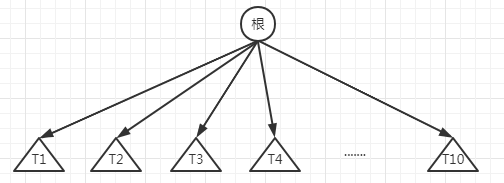
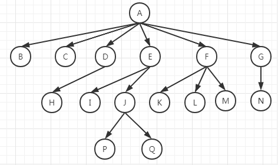
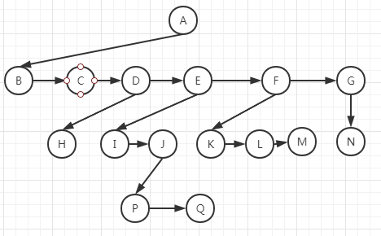
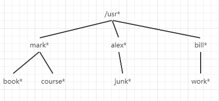

对于大量的输入数据，链表的线性访问时间太慢，二叉查找树结构的大部分操作时间平均为O(logN)。其是两种库集合类TreeSet和TreeMap
实现的基础。
## 基础
1. 树可以用几种方式定义，定义树的一种自然的方式是递归的方式，一棵树是一些节点的集合。这个集合可以是空集，若不是空集，则树
由称作根（root）的节点r以及0个或多个非空的（子）树T1、T2、...、Tk组成，这些子树中每一棵的根都被来自根r的一条有向的边
（edge）所连结。每一棵子树的根叫作根r的儿子（child），而r是每一棵子树的根的父亲（parent）。      
       
1. 从递归定义中可以发现一棵树是N个节点和N-1条边的集合，其中的一个节点叫作根。每条边都将某个节点连接到它的父亲，而除去根节
点外每个节点都有一个父亲所以只有N-1条边。      
          
1. 没有儿子的节点称为树叶（leaf，叶子节点），上图中的叶子节点是B、C、H、I、K、L、M和N。具有相同父节点的节点为兄弟节点，
用类似方法可以定义祖父和孙子关系。
1. 从节点n1到nk的路径定义为节点n1、n2、...、nk的一个序列，使得对于1<=i<k节点ni是n（i+1）的父亲。这条路径的长是该路径
上的边的条数即k-1.从每一个节点到它自己有一条长为0的路径。
1. 对任意节点ni的深度为从根到ni的唯一的路径的长。ni的高是从ni到一片叶子节点的最长路径的长，因此所有叶子节点的高都是0。
一棵树的高等于根的高。
## 树的实现
1. 实现树的一种方法可以是每一个节点除数据外还有一些链，使得该节点的每个儿子都有一个链指向它，然而由于每个节点的儿子数可
以变化很大并且实现不知道，因此在数据结构中建立到各子节点直接的链接是不可行的，因为这样会产生太多浪费空间。解决方法：将每
个节点的儿子都放在树节点的链表中。[TreeNode](../../java/org/lql/tree/TreeNode.java)就是典型的声明。如下图所示指出
了一棵树如何用这种方法表示出来，图中向下的箭头是指向firstChild的链，而水平箭头是指向nextSibling（下一个兄弟）的链。        
      
## 树的遍历及应用
1. 树有很多应用，流行用法之一是包括UNIX和DOS在内部的许多常用操作系统中的目录结构，如下图为UNIX文件系统中的典型目录。       
      
1. 遍历文件的路径采用递归，从根节点开始，这种遍历方式叫先序遍历。在先序遍历中对节点的处理是在它的儿子节点被处理之前进行。
1. 另一种遍历树的常用方法是后序遍历，在后序遍历中一个节点处的工作是在它的子节点被计算后进行。
