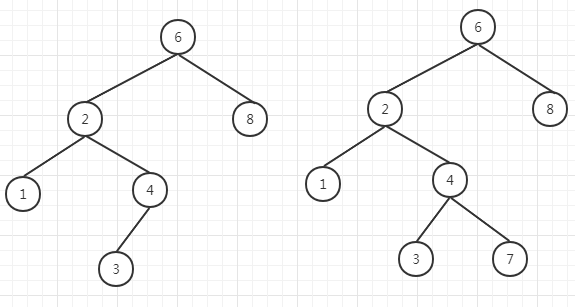

1. 二叉树的一个重要的应用是它们在查找中的使用。假设树中的每个节点存储一项数据，这里假设它们都是整数且所有项都是互异的。
1. 使二叉树成为[二叉查找树](../../java/org/lql/tree/BinarySearchTree.java)的条件是：对于树中的每个节点X，它的左子树中 
所有项的值小于X中的项，而它的右子树中所有项的值大于X中的项。这意味着该树所有的元素可以用某种一致的方式排序。如下图左侧是二叉
查找树，右侧为二叉树。         
      
1. 二叉查找树要求所有的项都能够排序，因此要提提供一个接口来标识这个特性，java中使用Cpmparable接口，树中的两项总能使用该
接口的compareTo方法进行比较，根据两项都相等当且仅当compareTo方法返回0来判断相等。另一种方法是使用函数对象。
1. 在二叉查找树的实现中完成了删除工作，但是它的效率并不高，因为它沿该树进行了两趟搜索以查找和删除右子树中最小的节点，如果删除
的次数不多，通常使用的策略是懒惰删除：当一个元素要被删除时，它仍留在树中，而只是被标记为删除。
