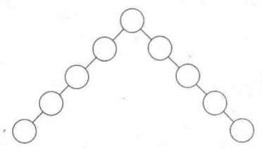
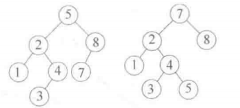
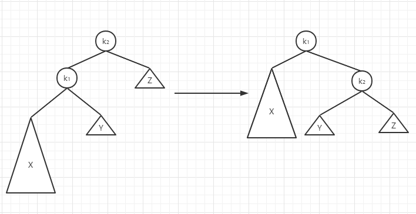
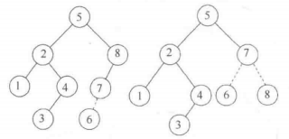
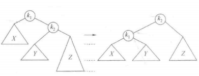
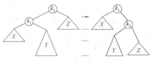
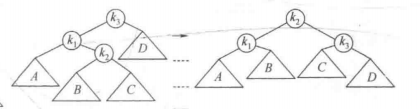
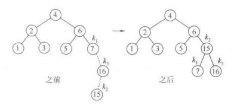
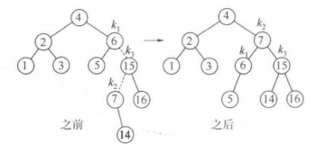

1. AVL树是带有平衡条件的二叉查找树，这个平衡条件必须要容易保持，而且它保证树的深度必须是O(logN)。最简单的想法是要求左右
子树具有相同的高度，这种平衡条件并不强求树的深度要浅，如下图所示：        
        
1. 另一种平衡条件是要求每个节点必须有相同高度的左子树和右子树，如果空子树的高度定义为-1，那么只有具有(2^k)-1个节点的理想平
衡树满足这个条件。因此虽然这种平衡条件保证了树的深度小，但是它他严格而难以使用，所以要放宽条件，一棵AVL树是其每个节点的左子
树和右子树的高度最多差1的二叉查找树，每一个节点保留高度信息。如下图所示左侧为AVL树，右侧不是：
      
1. 出去可能的插入外，所有的树操作都可以以时间O(logN)执行。当进行出入操作时，需要更新通向根节点路径上那些节点的所有平衡
信息，而插入操作隐含着困难的原因在于插入一个节点可能破坏AVL树的特性，如将6插入到上图中的AVL树将会破坏关键字为8的节点处
的平衡条件。如果发生这种情况，那么就要考虑这一步插入完成之前恢复平衡的性质。这通常可以通过对树进行简单的修正来做到，我们
称其为旋转。
1. 我们把必须重新平衡的节点叫作α，由于任意节点最多有两个儿子，因此出现高度不平衡就需要α点的两棵子树的高度差2，这种不平衡
可能出现在下面四种情况中：
    1. 对α的左儿子的左子树进行一次插入
    1. 对α的左儿子的右子树进行一次插入
    1. 对α的右儿子的左子树进行一次插入
    1. 对α的右儿子的右子树进行一次插入
1. 上述情况中1和4是关于α点的镜像对称，2和3是关于α的镜像对称，因此理论上只有两种情况，对于编程角度来说还是四种情况。第一
种情况插入发生在”外边“的情况（即左-左的情况或右-右的情况），该情况通过对树的一次单旋转而完成调整。第二种情况是插入发生在
“内部”的情形（即左-右或右-左的情况），该情况通过稍微复杂些的双旋转来处理。
## 单旋转
      
1. 如上图显示了单旋转如何调整情形1。节点k₂不满足AVL平衡性质，因为它的左子树比右子树深两层。为使树恢复平衡，我们把X上移一
层，并把Z下移一层。此时实际上超出了AVL特性的要求。为此我们重新安排节点以形成一棵等价树，如上图中右侧部分所示。在原树中
k₂>k₁，于是新树中k₂变成了k₁的右子节点，X和Z仍然分别是k₁的左子节点和k₂的右子节点。子树Y包含原树中介于k₁和k₂之间的那些节
点，可以将它放在新树中k₂的左子节点位置上。下图展示了将6插入左边原始的AVL树后节点8便不再平衡，于是在7和8之间做一次单旋转。      
          
         
1. 上图展示单旋转处理情形4的情况
## 双旋转
1. 如下图情形2和3使用单旋转的做法是无效的，问题在于Y太深，单旋转没有减低它的深度。        
         
1. 如下图所示为了重新平衡，不能把k₃用作根了，如果使用单旋转在k₃和k₁之间的旋转又解决不了问题，唯一的旋转就是把k₂用作新的
根。这迫使k₁是k₂的左子节点，k₃是它的右子节点，从而完全确定这四棵树的最终位置。          
         
1. 下图中插入16没有破坏平衡性，但是插入15就会引起节点7处的高度不平衡。这属于情形3，需要通过一次右-做双旋转来解决，在此
例中双旋转涉及7、16和15。此时k₁是含有项16的节点，而k₂是含有15的节点。           
         
1. 接着插入14，也需要一个双旋转。此时修复该树的双旋转还是右-左双旋转。      
         
1. 变成细节可总结为：将项是X的一个新节点插入树T中，将递归地将X插入到T的相应子树(TR)，如果插入操作没有引起树的高度发生改变则插入
完成。如果在T中的高度出现不平衡，则根据X以及T和TR中的项做适当的单旋转或双旋转，更新这些高度，从而完成插入。