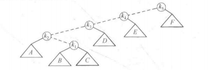
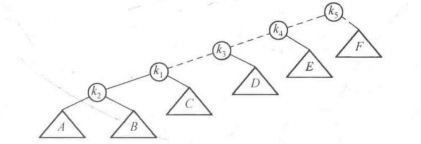
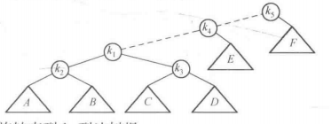
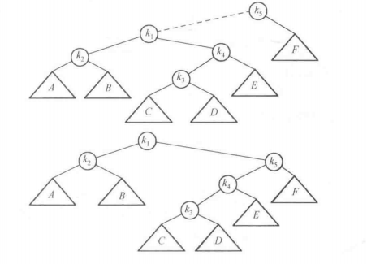
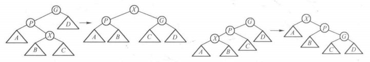
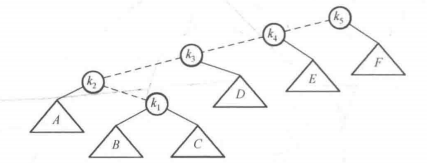
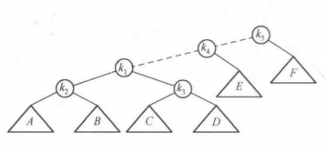
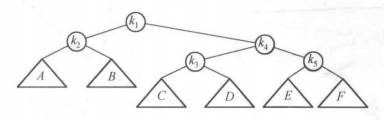

1. 伸展树：它保证从空树开始连续M次对树的操作最多花费O(MlogN)时间。虽然这种保证并不排除任意单次操作花费O(N)时间的可能。
1. 伸展树的基本想法是：当一个节点被访问后，它就要经过一系列AVL树的旋转被推到根上。如果一个节点很深，那么在其路径上就存在
许多相对较深的节点，通过重新构造可以减少对所有这些节点的进一步访问所花费的时间。因此如果节点过深，那么我们要求重新构造应
具有平衡这棵树的作用。在实际中许多应用中当一个节点被访问时，它很可能不久再被访问，而且伸展树还不要求保留高度和平很信息，
在某种程度上节省空间并简化代码。
## 简单的想法（不能直接使用）
实施基本想法中描述的重新构造的一种方法是执行单旋转，从底向上进行，这意味着我们将在访问路径上的每一个节点和它们的父节点实
施旋转。如下图的例子，考虑下面的树中对k₁进行一次访问（一次find）之后所发生的情况。        
     
虚线是访问的路径。首先我们在k₁和它的父节点之间实施一次单旋转，得到下面的树          
         
然后我们在k₁和k₃之间旋转，得到下一棵树。      
         
此后再试行两次旋转知道k₁到达树根。      
         
## 展开
1. 展开的思路类似于旋转的想法，不过在旋转如何实施上我们稍微有些选择的余地。我们仍然从底部向上沿着访问路径旋转。令X是在访
问路径上的一个（非根）节点，我们将在这个路径上实施旋转操作。如果X的父节点是树根，那么只要旋转X和树根。这就是沿着访问路径
上的最后旋转。否则，X就有父亲（P）和祖父（G），存在两种情况以及对称的情形要考虑。第一张情况是之字形情形，如下图左侧，X是
右子节点的形式，P是左子节点的形式。如果是这种情况，那么我们执行一次就像AVL双旋转那样的双旋转。否则出现另一种一字形情形：
X和P或者都是左子节点，或者其对称的情形，X和P都是右子节点。         
             
1. 下例中对k₁执行一次contains：      
         
展开的第一步是在k₁，显然是一个之字形，因此执行一次标准的AVL双旋转，得到如下树           
         
在k₁的下一步展开是一个一字形，因此我们在做一字形旋转，得到最后的树          
         
1. 展开与简单旋转的区别在于：简单旋转的时候在把访问节点旋转到根节点时同样会把别的节点推到很深的位置，而展开不仅仅把访问
的节点推到了根节点，而且还把访问路径上的大部分节点的深度大致减少一半。
1. 下例展示在项为一的节点展开        
         