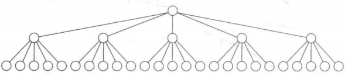
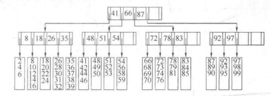
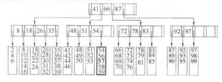
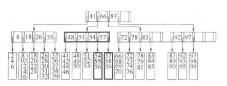

1. 前面介绍的树都是假设可以把整个数据结构存储到计算机的内存中。可是如果数据更多就会出现内存装不下的情况，那么意味着必须
把数据结构放在磁盘上。此时因为大O模型不再使用，所以导致游戏规则发生改变。大O分析假设所有的操作耗时都是相等的。然而现在这
种假设不合适了，特别是涉及磁盘I/O的时候。
1. 如果有一台机器每秒执行5亿条指令，另一方面，磁盘操作是机械运动，它的速度主要依赖于转动磁盘和移动磁头的时间。许多磁盘以
7200RPM旋转，即1分钟转7200转；因此1转要1/120秒即8.3毫秒。平均可以认为磁盘转到一半的时候发现我们要寻找的信息，但这又被
移动磁头的时间抵消，因此我们得到访问时间为8.3毫秒。因此每秒大约可以进行120次磁盘访问。即5亿条指令花费的时间相当于120次
磁盘访问的时间，也就是说一次磁盘访问的价值大约是40万调指令。
1. 在磁盘上，典型的查找树执行如下：设想要访问某地公民的驾驶记录，假设有1千万项，每一个关键字是32字节（代表一个名字），而
一个记录是256个字节。如果这些数据不能装入内存，而我们是正在使用系统的20个用户中的一个（因此有二十分之一的资源）。这样在1
秒内可以执行2500万次指令，或者执行6次磁盘访问。
1. 不平衡的二叉查找树是一个灾难，最坏情形下它具有线性的深度，从而可能需要一千万次磁盘访问，平均来看一次成功的查找可能需要
1.38logN次磁盘访问，由于log1000 0000约等于24，因此平均一次查找需要32次磁盘访问，或5秒时间。相比而言AVL树限制了树的高
度，因此表现要好一些，其典型的情形是非常接近logN的，一棵AVL树平均将使用大约25次磁盘访问，需要的时间是4秒。
1. 根据上述情况，我们想要把磁盘访问次数减小到一个非常小的常数，比如3或4，以此来提升读取磁盘上内容的效率，只是程序必然会
复杂，但是在合理的情况下机器指令基本上是不占时间的。由于典型的AVL树接近于最优高度，使用二叉查找树是不可行的。简单的处理
方法：如果有更多的分支，那么就有跟小的高度。这样31个节点的理想而二叉树有五层，而31个节点的5叉树则有3层，如下图所示。一
棵M叉树可以有M路分支，随着分支增加，树的深度在减少。一棵完全二叉树的高度大约为logN，而一棵完全M叉树的高度大约是log(M)N。         
     
1. 我们可以与建立二叉查找树大致相同的方式建立M叉查找树。在二叉查找树中，需要一个关键字来决定两个分支到底取哪个分支；而在
M叉查找树中需要M-1个关键字来决定选取哪个分支。为是这种方案在最坏情况下有效，需要保证M叉查找树以某种方式得到平衡，否则可能
像二叉查找树那样退化成一个链表，甚至我们不想M叉查找树退化到二叉查找树。
1. 实现这种想法的一种方法是使用B树。原则上B树保证只有少数的磁盘访问。
1. 阶为M的B树是一棵具有下列特性的树：
    1. 数据项存储在叶子节点上。
    1. 非叶子节点存储直到M-1个关键字以指示搜索方向；关键字i代表整数i+1中的最小关键字。
    1. 树的根或者是一个叶子节点，或其子节点树在2和M之间。
    1. 除根外，所有非叶子节点的子节点数在M/2和M之间。
    1. 所有的树叶都在相同深度上并有L/2和L之间个数项。
1. 下图显示5阶B树的一个例子，所有非叶子节点的儿子数都在3和5之间，根可能只有两个儿子。这里我们有L=5，只是恰好跟M相等而已
，由于L是五，因此每片树叶有3到5个数据项。要求节点半满将保证B树不至于退化成简单的二叉树。          
         
1. 下图中把57插入B树中，此时把它当做第5项添加到叶子节点中。此时只要重新组织该叶子节点上的所有数据，这和磁盘访问相比这项
操作的开销可以忽略不计。            
         
1. 下图以上例为基础继续插入55，此时55想要插入其中的那片树叶已经满了，由于我们现在有L+1项，因此把它们分成两片树叶，这两
片树叶保证都有所需要的记录的最小个数。形成两片树叶，每叶三项。写这两片树叶需要2次磁盘访问，更新它们的父节点需要3次磁盘访
问。因为在父节点中关键字和分支均发生了变化，但是这种变化是以容易计算的受控方式处理的。虽然分裂节点是耗时的，因为它至少需
要2次附加的磁盘写，但这相对很少发生。最终如下图            
             