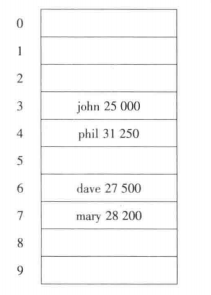
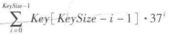
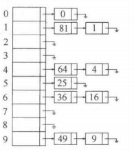
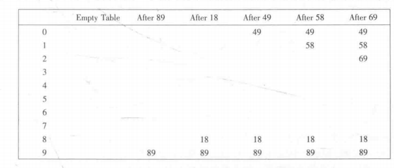
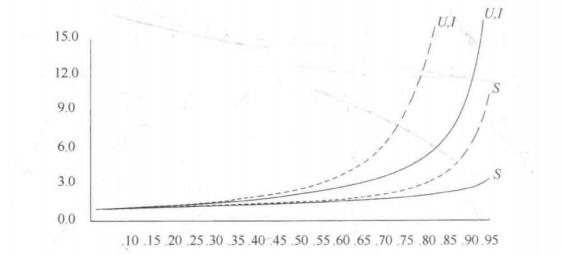
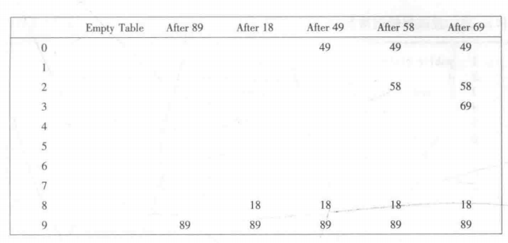
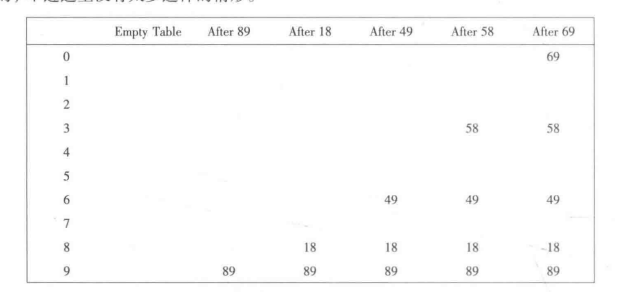

## 一般想法
1. 散列表的实现常常叫作散列（hashing）。散列是一种用于以常数平均时间执行插入、删除和查找的技术。那些需要元素间任何排序信息
的树操作将不会得到有效支持，因此如findMin、findMax以及以线性时间将排过序的整个表进行打印的操作都是散列所不支持的。
1. 理想的散列数据结构只不过是一个包含一些项的具有固定大小的数组。通常查找是对项的某个部分（即数据域）进行的，这个部分叫作
关键字（key）。如项可以由一串可以作为key的关键字和其他一些数据域组成。把表的大小记作TableSize，并将其理解为散列数据结构
的一部分，而不仅仅浮动于全局的某个变量。
1. 每个关键字被映射到从0到TableSize-1这个范围中的某个数，并且被放到适当的单元中。这个映射就叫做散列函数，理想情况下它应
该计算起来简单，并且应该保证任何两个不相同的关键字映射到不同的单元。不过因为单元的数目是有限的，而关键字实际上是用不完的。
因此，我们寻找一个散列函数，该函数要在单元之间均匀的分配关键字。如下图就是完美情况下的一个典型，在下例中john散列到3，phil
散列到3，dave散列到6，mary散列到7，这就是散列的基本思想。剩下的问题就是选择一个函数，决定当两个关键字散列到同一个值即冲
突时应该做什么以及如何确定散列表的大小。        
           
## 散列函数
1. 如果输入的关键字是整数，则一般合理的方法就是直接返回Key mod TtableSize，除非Key碰巧具有某些不合乎需要的性质。在这
种情况下，散列函数的选择需要仔细地考虑。例如，若表的大小是10而关键字都以0为个位，则此时上述标准的散列函数就不是一个好的
选择。为了避免这样的情况，好的爆发通常是保证表的大小是素数。当输入的关键字是随机整数时，散列函数不仅计算起来简单而且关键
字的分配也很均匀。
1. 通常关键字是字符串，这种情况下散列函数也需要仔细选择：
    1. 一种现在方法是把字符串中字符的ASCII码（或Unicode码）值加起来在mod TableSize,如以下代码实现起来简单而且能够很
    快地计算出答案。不过，如果表很大，函数将不会很好地分配关键字，如TableSize为10007，并设左右的关键字至多8个字符长。
    由于ASCII字符的值最多是127，因此散列函数只能假设值在0和1016（127*8）之间，显然不能做到均匀分配。
        ```
           public static int hash(String key, int tableSize) {
                int hashVal = 0;
                
                for(int i = 0; i < key.lenth(); i++) {
                    hashVal += key.charAt(i);
                }
                
                return hashVal % tableSize;
           }   
        ```
    1. 另一种散列函数假设Key至少有3个字符。值27表示英文字母表的字母外加一个空格的个数，而729是27的平方。该函数只考查
    前三个字符，但是如果它们是随机的，而表的大小像前面那样还是10007，那么我们就会得到一个合理的均匀分布。可是英文并不
    是随机的。虽然3个字符（忽略空格）有17576（26的三次方），但是实际上查阅足够大的联机词典3个字母的不同组合数实际只有
    2851。即使这些组合没有冲突也不过只有表的28%被真正散列到。因此虽然很容易计算，但是当散列表具有合理大小的时候这个函
    数还是不合适的。
        ```
           public static int hash(String key, int tableSize) {
                return (key.charAt(0) + 27 * key.charAt(1) + 729 * key.charAt(2)) % tableSize;
           }   
        ```
    1. 第三种方法散列函数涉及关键字中的所有字符，并且一般可以分布的很好，程序根据Horner法则计算一个37的多项式函数。如
    计算h(k)=K0 + 37k1 + 37*37k2的另一种方式借助公式h(k)=((k2)*37 + k1)*37+k0进行。这个散列利用到允许溢出的事实。
    可能会引进负数。在下面展示的代码就表的分布而言未必是最好的，但确实具有极其简单的优点而且速度也很快。如果关键字特别
    长，那么该散列函数计算起来将会花费很多时间。这种情况下通常的经验是不使用所有字符。         
              
        ``` 
            public static int hash(String key, int tableSize){
                int hashVal = 0;
                
                for(int i = 0; i < key.length(); i++) {
                    hashVal = 37 * hashVal + key.charAt(i);
                }
                
                hashVal %= tableSize;
                if(hashVal < 0) {
                    hashVal += tableSize;
                }
                return hashVal;
            }
        ```
1. 快速有均匀的算法确定好，剩下就是解决冲突的问题。
## 分离链接法
1. 解决冲突的第一种方法通常叫作分离链接法，其做法是将散列到同一个值的所有元素保留到一个表中。我们可以使用标准库的实现方
法。如果空间很紧则更可取的方法是避免使用它们，因为这些表是双向链接的并且浪费空间。假设关键字是前10个完全平方数并设散列函
数就是hash(x) = x mod 10，如下图所示         
          
1. 为执行一次查找，我们使用散列函数来确定究竟遍历那个链表。然后我们再被确定的链表中执行一次查找。为执行insert，我们检查
相应的链表看看该元素是否已经处在适当的位置。如果这个元素是个新元素，那么它将被插入到链表的前端，这不仅因为方便，还因为常
常发生这样的事实：新近插入的元素最有可能不久又被访问。
1. 实现[分离链接法](../../java/org/lql/hash/SeparateChainingHashTable.java)，散列表存储一个链表数组，它们在构造
方法中被指定。就像二叉查找树只对那些Cpmparable的对象工作一样，散列表只对遵守确定协议的那些对象工作。在jiava中这样的对
象必须提供适当equals方法和返回一个int型量的hashCode方法，此时散列表把这个int型量通过myHash转成适当的数组下标。除了链
表外任何方案都可以解决冲突现象：一个二叉查找树或甚至另一个散列表都可以，但是我们期望如果散列表是大的并且散列函数是好的，
那么所有的链表都应该是短的，从而任何复杂的尝试就都不值得考虑。
1. 我们定义散列表的装填因子（load factor）λ为散列表中的个数对该表大小的比。即链表的平局长度为λ。执行一
次查找所需要的工作是算散列函数值所需要的常数时间加上遍历链表所用的时间。在一次不成功的查找中，要考查的节点数平均为λ。一
次成功的查找则需要遍历大约1+(λ/2)个链。注意被搜索的链表包含一个存储匹配的节点再加上0个或更多其他的节点。在N个元素的散列
表以及M个链表中其他节点的期望个数为(N-1)/M=λ-1/M，它基本上就是λ，因为假设M是大的，平均来看一半的其他节点被搜索到，散列
表的大小实际上并不重要，而装填因子才是重要的。
1. 分离链接散列法的一般法则是使得表的大小与预料的元素个数大致相等即让λ约等于1。所以在插入方法中如果装填因子超过1，那么
我们就通过rehash函数过大散列表的大小。
## 不用链表的散列
1. 分离链接散列算法的缺点是使用一些链表，由于给新单元分配地址需要时间，因此这就导致算法的速度有些减慢，同时算法实际上还
要求对第二种数据结构的实现。另一种不用链表解决冲突的方法是尝试另一些单元，知道找出空的单元位置。常见的是h0(x)，h1(x)，
h2(x)...相继被试选，之中hi(x)=(hash(x)+f(i)) mod TableSize，且f(0)=0。函数f是冲突解决的方法。因为所有的数据都要置
入表内，所以这种解决方案所需要的表要比分离链接散列的表大。一般来说，对于不适用分离链接的散列表来说，其装填因子应该低于
λ=0.5。这样的表叫作探测散列表。
### 线性探测法
1. 在线性探测法中函数f是i的线性函数，典型情形是f(i)=i。这相当于相继探测逐个单元（必要时可以回绕）以找出一个空单元。如下
图所示使用与前面相同的散列函数将各个关键字（89，18，49，58，69）插入到一个散列表中的情况，而此时的冲突解决方法就是f(i)=i。           
      
1. 如上图所示只要表足够大，总能够找到一个自由单元，但是如此花费的时间是相当多的。更糟的是，即使表相对较空，这样占据的单
元也会开始形成一些区块，其结果称为一次聚集，就是说散列到区块中的任何关键字都需要多次试选单元才能够解决冲突，然后该关键
字被添加到相应的区块中。
1. 使用线性探测的预期探测次数对于插入和不成功的查找来说大约为(1+1/(1-λ)^2)/2，而对于成功的查找来说则是(1+1/(1-λ))/2
容易看出插入和不成功查找需要相同次数的探测，成功查找应该比不成功查找平均花费较少时间。
1. 如果聚集不算是问题，那么对应的公式就不难看出，我们假设有一个很大的散列表，并设每次探测都与前面的探测无关。对于随机冲
突解决方法而言，这些假设是成立的，并且当λ不是非常接近于1时也是合理的。如下图所示（虚线为线性探测，实现为随机方法的装填因
子活出的探测次数，S为成功查找，U为不成功查找，I为插入）。如果表可以多于一般被填满的话，那么线性探测就不是个好办法。如果
λ=0.5，那么插入操作平均只需要2.5次探测，并且对于成功的查找平均只需要1.5次探测。           
              
### 平方探测法
1. 平方探测是消除线性探测中一次聚集问题的冲突解决方法。平方探测就是冲突函数为二次的探测方法。流行的选择是f(i)=i^2.如
下图显示插入线性探测例子同样的项得到的散列表。         
          
1. 对于线性探测让散列表几乎填满元素并不是个好主意，因为此时表的性能会降低。对于平方探测情况甚至更糟：一旦表被填充超过一半，
当表的大小不是素数时甚至在表被充满一半之前就不能保证一次找到空的单元了。这是因为最多有表的一半可以用作解决冲突的备选位置。
1. [平方探测实现](../../java/org/lql/hash/QuadraticProbingHashTable.java)排除了一次聚集，但是散列到同一位置上的那
些元素将探测相同的备选单元，这叫作二次聚集。
### 双散列
1. 最后一种解决冲突方法是双散列。对于双散列，一种流行选择是f(i)=i hash2(x)。这个公式是说，我们将第二个散列函数应用到x
并在距离hash2(x)，2hash2(x)，...等处去探测。hash2(x)选择的不好将会是灾难性的。如把99插入到前面例子中的输入中去，通常
的选择hash2(x)=x mod 9将不起作用。因此函数一定不要算得0值。另外，保证所有的单元都能被探测到也是很重要的，在下面的例子
中这是不可能的，因为表的大小不是素数。如hash2(x)=R-(x mod R)这样的函数将起到良好的作用，其中R为小于TableSize的素数。
如果我们选择R=7，则如下图          
      
1. 第一次冲突发生在49被插入的时候，hash2(49)=7-(49 mod 7)=7，因此插入位置6。hash2(58)=7-(58 mod 7)=5，于是58被插入
位置3，以此类推。
1. 上面的散列表实例的大小不是素数。这只是为了举例方便，实际上使用双散列保证表的大小为素数时很重要的。如果想要把23插入到表
中，那么它就会与58发生冲突。由于hash2(23)=7-2=5，且该表的大小是10，因此我们实际上只有一个备选位置，而这个位置已经被使用
了。因此如果表的大小不是素数，那么备选单元就可能提前用完。
1. 如果双散列正确实现，则模拟表明，预期的探测次数几乎和随机冲突解决方法的情形相同。这使得双散列理论上很有吸引力。但是平方
探测不需要使用第二个散列函数，从而在实践中使用可能更简单并且更快。特别是对于像串这样的关键字，它们的散列函数计算起来相当耗
时。
## 再散列（rehash）
1. 对于使用平方探测的开放定址散列法，如果散列表填的太满，那么操作的运行时间将开始消耗过长，且插入操作可能失败。这可能发
生在有太多的移动和插入混合的场合，此时一种解决方法是建立另外一个大约两倍大的表，扫描整个原始散列，计算每个未删除的元素的
新散列值将其插入到新表中。
1. 将原树13、15、24和6插入到大小为7的线性探测散列表中，散列函数是h(x)=x mod 7。设使用线性探测法解决冲突问题，
插入结果为下图：        
      
如果将23插入表中，那么下图中出入的表将有超过70%的单元是满的。因为散列表太慢，所以我们建立一个新表。该表大小为17，因为
17是原表大小两倍后的第一个素数。新的散列函数为h(x)=x mod 17.扫描原表并将元素插入新表，得到最终结果。          
          
          
1. 再散列可以用平方探测多种方法实现。一种做法是只要表满到一半就再散列。另一种极端的方法是只有当插入失败时才再散列。第三
种方法即途中策略：当散列表到达某一个装填因子时进行再散列。由于随着装填因子的增长散列表的性能确实下降，因此，以好的截止手
段实现的第三种策略可能是最好的策略。