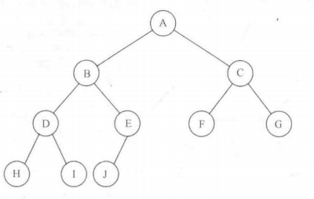

## 模型
优先队列是允许至少两种操作的数据结构：insert和deleteMin。insert操作等价于enqueue，而deleteMin则是运算dequeue在优先
队列中的等价操作。      
       
## 一些简单的实现
我们可以使用一个简单链表在表头以O(1)执行插入插座，并比那里该链表以删除最小元素，这又需要O(N)时间。另一种方法是始终让链表
保持排序装填，这使得插入代价高昂O(N)而deleteMin花费低廉O（1）。基于deleteMin的操作从不多于插入操作的事实，前者应该是更
好的想法。       
除了链表实现有线队列还可以使用二叉查找树，它对两种操作的平均运行时间都是O(logN)。尽管插入是随机，而删除则不是，但这个结
论还是成立的。我们删除的唯一元素是最小单元，反复出去左子树中的节点视乎会损害树的平衡，使得右子树加重，然而右子树是随机的。
在最坏情形下，即DeleteMin将左子树删空了，右子树拥有的元素最多也就是它应具有的两倍。          
使用查找树可能有些过分，因为它支持许许多多并不需要的操作。我们将要使用的基本点数据结构不需要链，它以最坏情形时间O(logN)
支持上述两种操作。插入操作实际上将花费常数平均时间。然后，在实现优先队列支持有效的合并时，这个附加的操作有些复杂，它显然
需要使用链接的结构。
## 二叉堆
二叉堆：它的使用对于优先队列的实现相当普遍，一直与当堆这个词不加修饰地用在优先队列的上下文中，一般都是值数据结构的这
种实现。我们把二叉堆叫作堆，像二叉树一样，堆也有两个性质，即结构性和堆序性。类似AVL树，对堆的一次操作可能破坏这两个性质
的一个，因此堆的操作必须到堆的所有性质都被满足才能终止。
### 结构性质
1. 堆是一棵被完全填满的二叉树，有可能的例外是在底层，底层上的元素从左到右填入。这样的树称为完全二叉树。           
          
1. 一棵高位h的完全二叉树有2^h到2^(h+1)-1个节点，这意味着完全二叉树的高是logN，显然它是O(logN)。
1. 因为完全二叉树这么有规律，所以它可以用一个数组表示而不需要使用链。            
          
1. 对于数组中任一位置i上的元素，其左儿子在位置2i上，右儿子在左儿子后的单元2i+1中，它的父亲则在位置i/2上，因此这里不仅
不需要链，而且遍历该树所需要的操作极简单，在大部分计算机上运行很可能非常快。这种实现方法的唯一问题在于最大的堆大小需要事
先估计，但一般这并不成问题，如果需要，我们可以重新调整大小。因此一个堆结构将由一个（Comparable对象的）数组和一个代表当
前堆大小的整数组成。
### 堆序性质
1. 堆序性质：让操作快速执行的性质。由于我们想要快速找出最小元，因此最小元应该再根上。如果考虑任意子树也应该是一个堆，那
么任意节点就应该小于它的所有后裔。
1. 应用这个逻辑，我们得到堆序性质：在一个堆中，对于每一个节点X，X的父亲中的关键字小于或等于X中的关键字，根节点除外。下图
中昨天的树是一个堆，而右边的树则不是，虚线处堆序性质被破坏。          
 
### 基本的堆操作
[BinaryHeap](../../java/org/lql/heap/BinaryHeap.java)           
1. （insert）为将一个元素插入到堆中，我们在下一个可用位置创建一个空穴，否则该堆将不是完全树。如果X可以放在该空穴中而并不
破坏堆的序，那么插入完成。否则我们把空穴的父节点上的元素移入该空穴，这样空穴就朝着根的方向上冒一部。继续该过程指导X能被放
入空穴中为止，这种策略叫做上滤。下图展示了将14插入的情形     
              
              
1. （deleteMin）以类似于插入的方式处理。找出最小元很容易，困难的是删除它。当删除一个最小元时，要在根节点建立一个空穴。
由于现在少了一个元素，因此堆中最后一个元素X必须要移动到该堆的某个地方。如果X可以被放到空穴中，那么deleteMin完成。不过
这一般不太可能，因此我们将空穴的两个儿子中较小这移入空穴中，这样就把空穴向下推了一层。这叫作下滤。如下图所示删除13      
          
          
          
## d-堆
d-堆是二叉堆的简单推广，它就像一个二叉堆，只是所有的节点都有d个儿子。