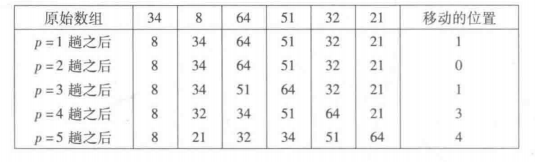

1. 插入排序是最简单的排序算法之一。插入排序由N-1趟排序组成，对于p=1到N-1趟，插入排序保证从位置0到位置p上的元素为已排序
状态。插入排序利用了这样的事实：已知位置0到位置p-1上的元素已经处于排过序的状态。          
           
1. 上图表达了一般的策略。在第P趟我们将位置p上的元素像左移动，知道它在前p+1个元素中的正确位置被找到的地方。
1. [代码](../../java/org/lql/sort/InsertSort.java)
1. 插入排序由于嵌套循环的每一个都花费N次迭代，因此插入排序为O(N^2)，另一方面如果输入数据已预先排序，那么运行时间为O(N)，
因为内层for循环的检测总是立即判定不成立而终止。事实上如果输入几乎被排序，那么插入排序将运行的很快。